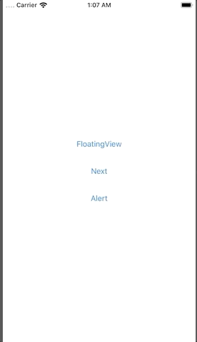
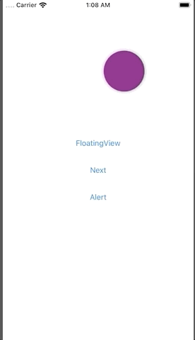
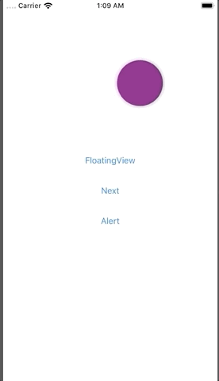
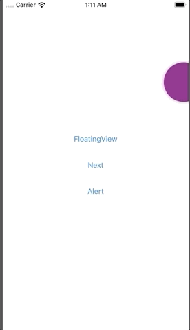

# WHFloatingView
A simple floating view which always on the top of screen.
## Example
Show/Hide floating view    
    

Presenting another view.    

Show alert.    
    

Present the entry view from floating view.    

## Author
[Wayne Hsiao](mailto://chronicqazxc@gmail.com)
